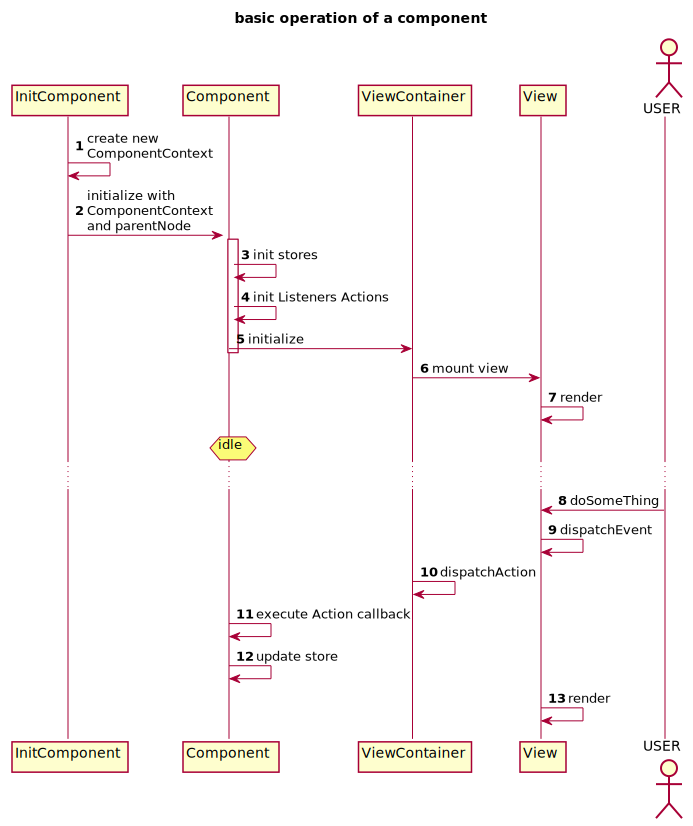
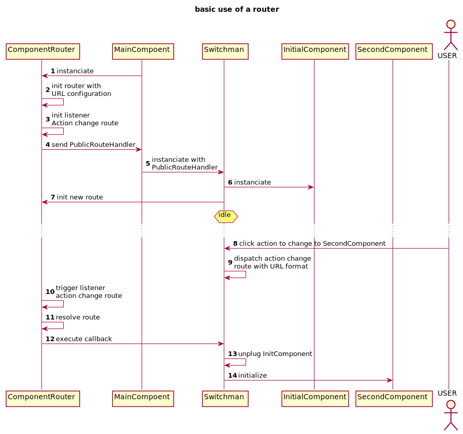

# Philosophie HotBalloon

> Prérequis : pattern publish subscribe, callbacks

HotBalloon est un framework développé et utilisé par Flexio, une solution 
de digitalisation innovante. Il est basé sur [le pattern flux](https://facebook.github.io/flux/docs/in-depth-overview.html). 
Le framework HotBalloon lié à ce pattern est un outil laissant beaucoup de 
liberté au développeur, il faudra donc comprendre la philosophie de ce 
framework pour implémenter des applications de manière simple et intelligible. 
Cette documentation a pour but de vous procurer les 
éléments nécessaires pour atteindre ces objectifs.

Vous avez à votre disposition le code source du site que vous êtes 
en train de lire qui a été développé à l'aide d'HotBalloon! Vous avez donc un premier exemple de développement, vous permettant ainsi d'apprendre par le code.
Le code que je vais passer au projecteur dans ce document ne permettra pas à lui seul de vous permettre 
d'implémenter une application utilisant HotBalloon, ce document donne uniquement un fil conducteur vous permettant de 
saisir la logique associée à cet outil. 

Premier point : le framework demande d'écrire une quantité de code conséquent. 
Pourquoi commencer par un point négatif ? Devriez-vous utiliser un outil qui ne vous fait pas gagner de temps ?
Il ne s'agit pourtant pas d'un point négatif ! (ah bon ?) Oui ! Et vous vous en rendrez compte par son utilisation.
Une application HotBalloon a pour avantage d'être très verbeuse, chaque information est décrite de manière claire et pourtant 
précise, ce qui permet une relecture et une maintenabilité du code aisée. En parlant de maintenabilité, sachez que l'ajout de nouvelles fonctionnalités
est rapide, et tout en respectant la lisibilité de l'application.


Dans une application HotBalloon, chaque acteur a sa propre place et ne joue pas plusieurs rôles. 
Chaque acteur a pour objectif d'effectuer une tâche qui lui est propre dans le traitement des données. Ces acteurs définissent un environnement symbolisant une boucle utilisant de l'événementiel :


Ici, le bouton de la vue permet d'incrémenter un compteur. La vue déclenche cette fameuse boucle. Elle n'a pas du tout conscience de ce qu'elle va déclencher,
elle va simplement envoyer un signal qui va être reçu par quiconque veut l'entendre.

Là intervient un acteur nommé View Container qui va s'intéresser à ce signal, qu'il va traduire en une 
action qui va permettre d'incrémenter un compteur qu'il va envoyer au dispatcher.

Le dispatcher a pour rôle d'envoyer l'action. Il va effectuer le rôle de facteur en envoyant un signalement 
auprès de chaque Component qui aura souscrit un abonnement auprès de cette action.

Le component traitera ensuite le signal, il va traduire comme l'action d'incrémenter un compteur, il va donc s'exécuter à l'aide d'une logique métier qu'il connaît.
Cette logique va permettre de mettre à jour un centre de stockage où est située la valeur du compteur appelé le store.

Une fois la valeur modifiée dans le store (modification par incrémentation), le store va envoyer un signal pour dire qu'il a changé.
Ce signal sera reçu par le ViewContainer qui va relayer cette information à la vue qui affiche le compteur pour mettre à jour la valeur affichée.

> Notez que le component a également la possibilité de dispatcher une action, à destination de lui-même ou d'un autre component de l'application.
> Oui ! On peut avoir plusieurs components dans la même application, on peut donc avoir plusieurs boucles événementielles au sein de la même application.
> Ce mécanisme va nous permettre de factoriser l'application et de la rendre modulaire. Et tout ceci s'effectue de manière très naturelle pour un développeur normalement constitué !

Sans cette vision globale, vous ne parviendrez pas à comprendre ce qui va suivre, 
prenez un peu de temps pour bien ancrer ce schéma dans votre tête, sans lui vous n'irez pas loin !

Maintenant les présentations faites, nous allons nous intéresser à la partie conception. 

> Qu'allez-vous devoir dire dans votre implémentation javascript pour fabriquer un compteur qui s'incrémente avec un bouton ?

Pour répondre à cette question, je vais énumérer les différentes entités que vous allez devoir développer et la manière dont vous allez les utiliser.

### structure du projet

```
└── component-counter
      ├── __tests__
      ├── assets
      │     ├── css
      │     └── img
      ├── component
      │     ├── ComponentCounter.js
      │     └── InitComponentCounter.js
      ├── actions
      │     └── ActionIncrement
      │             ├── ActionIncrement.js
      │             ├── InitActionIncrement.js
      │             └── ListenActionIncrement.js
      └── stores
      │     └── counterStore
      │             ├── InitSoreCounter.js
      │             ├── StoreCounter.js
      │             └── StoreHandlerCounter.js
      ├── views
      │     └── counterView
      │         ├── ContainerCounter.js
      │         ├── InitViewContainerCounter.js
      │         └── views
      │                 └── ViewCounter.js
      ├── index.js
      └── package.json
```


### Stores
Trois classes représentent un store : 
- le store qui est l'entitée qui stock
```javascript
/**
 * @extends Store
 */
export class StoreCounter extends Store {
}
```

- le StoreData qui est un schéma des données qui doivent être stockées
```javascript
/**
 * @extends DataStoreInterface
 */
export class StoreDataCounter extends DataStoreInterface {
  /**
   *
   * @param {int} value
   */
  constructor(value = 0) {
    super()
    this.value = value
  }
}
```

- le StoreHandler qui permet d'effectuer des accès en lecture sur le store (poxy)
 ```javascript
/**
 * @extends PublicStoreHandler
 */
export class StoreHandlerCounter extends PublicStoreHandler {
  /**
   *
   * @returns {int}
   */
  get value() {
    return this.data().value
  }
}
 ```   
    
### Actions

L'action, comme dit plus haut, est un "singal", elle permet de mettre en relation la vue et le component.

On crée une action de cette manière :

```javascript
const ACTIONS_EXAMPLE = 'ACTIONS_ADD_NUMBER'
/**
 * @extends Action
 */
export class ActionIncrement extends Action {
  constructor() {
    super(new ActionParams(ACTIONS_EXAMPLE, ActionPayload))
  }
}
```

Pour dispatcher (envoyer au postier) une nouvelle action :
```javascript
this.dispatchAction(
  ActionIncrement.withPayload(
    new ActionPayload()
  )
)
```
Ici, on dispatch une action "ActionIncrement"

> le mot Payload vous attire forcément l'œil, sachez que nous en reparlerons en détail, mais gardez à l'esprit qu'une action peut être plus qu'un simple signal,
> elle peut transporter des données avec elle ! Bonne nouvelle non ?

Une fois dispatché, on pourra écouter cette action de la manière suivante :
```javascript
component.componentContext.listenAction(
  DispatcherEventListenerFactory.listen(
    new ActionIncrement())
    .callback((payload) => {
      doSomeThings()
    })
)
```
Une fois l'action capturée dans ce listener, le callback va se charger d'exécuter le code (doSomeThings), dans le cas de notre compteur, 
l'action "ActionIncrement" devrait permettre de changer le contenu du store. 

### Component
Le component est l'élément princiaple, c'est notre point d'entré pour l'initialisation de toute la boucle d'événementielle.
Il est constitué d'un component context qui permet de :
   - ajouter des actionsUtil et de les écouter,
   - dispatcher (envoyer) des actionsUtil,
   - ajouter des storesBuilder,
   - ajouter des conteneurs de vues.
   
Il va devoir initialiser les storesBuilder qui veut utiliser : 
```javascript
export const addStoreCounter = (component) => {
  return component.componentContext.addStore(
    new StoreCounter(
      COUNTER_STORE,
      new InMemoryStorage(
        new State(NAVBAR_STORE, new StoreDataCounter(0)),
        new StoreDataCounter()
      )
    )
  )
}
```
Ici le component, passé en paramètre, va ajouter, à l'aide du component context, le store StoreCounter. Un store a besoin
d'un id : COUNTER_STORE et d'un moyen de stockage, ici en mémoire.
Le store est initialisé avec le schéma StoreDataCounter contenant l'attribut value initilisaé à 0.

Le component va également enregistrer les actionsUtil qu'il a besoin d'écouter : 
```javascript
export const addActionIncrementCounter = (component) => {
  component.componentContext.listenAction(
    DispatcherEventListenerFactory.listen(
      new ActionIncrement())
      .callback((payload) => {
        let result = component.counterStore.data().value + 1
        component.counterStore.set(new StoreDataCounter(result))
      })
      .build()
  )
}
```
On va donc ajouter un listener comme décrit plus haut, et dans le callback, on va récupérer le
résultat de "value" contenu dans le store counterStore. On va ensuite redéfinir la donnée de counterStore
avec la valeur actuelle incrémenté. 

On initialise enfin le ViewContainer, il doit être branché sur des storesBuilder pour que les vues puissent les utiliser.
```javascript 
export const addExampleViewContainer = (component) => {
  const VIEWCONTAINER_ID = component.componentContext.nextID()
  return component.componentContext.addViewContainer(
    new ViewContainerCounter(
      new ViewContainerParameters(
        component.componentContext,
        VIEWCONTAINER_ID,
        component.parentNode
      ),
      new ContainerStores(component.counterStoreHandler)
    )
  )
}
```
Le ViewContainer est obligatoirement initialisé avec un object permettant de définir les 
paramètres de celui-ci. Ces paramètres contiennent le componentContext du component, un id (ici géneré par le
componentContext et le noeud du DOM sur lequel sera branché les vues du ViewContainer.

Il peut également contenir des storesBuilder même si cela n'est pas obligatoire. 
ContainerStores représente ici un ValueObject qui permet de containeriser les différents storesBuilder
qui vont être utilisé par le viewContainer : 
```javascript 
export class CounterContainerStoresParams {
  constructor(counterStore) {
    this.__counterStore = TypeCheck.assertStoreBase(counterStore)
  }

  get counterStore() {
    return this.__counterStore
  }
}
```


### Views
Pour créer une vue, on écrit un tempate qui va décrire ce que le doit afficher la vue. Cette vue est branchée sur des storesBuilder qui vont 
permettre de mettre à jour cette vue. On écrit un tempate de cette manière : 
```javascript 
/**
 *
 * @return {Element}
 */
template() {
  return this.html('div#divCounter.containerCounter',
    HtmlParams
      .addChildNodes([
        this.html('span#counter.counter', HtmlParams.withText(this.__stores.counterStore.value)),
        this.html('input#increment.button',
          HtmlParams
            .withAttributes(
              { value: 'Increment', type: 'button' })
            .addEventListener(
              NodeEventListenerFactory.listen('click')
                .callback((e) => {
                  this.dispatch(INCREMENT_EVENT, null)
                })
                .build()
            )
        )
      ])          
  )    
}
```
Ce tempate nous permet de créer un noeud div, constitué d'un id divCounter et d'une classe nommée containerCounter.
Ce noeud est composé de 2 nœud fils : 
- un nœud span qui a pour texte la valeur contenue dans le store counterStore.
- un nœud input de type bouton et qui a pour valeur "increment". Ce bouton contient un listener, en cas de click
sur celui-ci, un évènement INCREMENT_EVENT va être dispatché.


### ViewContainers
Comme décrit plus haut, une vue envoie des événements. Ceux-ci vont être captés par le ViewContainer. Il a pour but
d'enregistrer les vues et les différents événements associés à ces vues.

Pour enregister une vue :
```javascript
this.addView(
      new CounterViewSimple(
        new ViewParameters(COUNTER_VIEW, this),
        new ContainerStore(this.stores.counterStore)
      )
    )
```
Chaque vue contient un viewParamter constitué d'un id : COUNTER_VIEW initialisé de la sorte : 
```javascript
const COUNTER_VIEW = Symbol('COUNTER_VIEW')
```
Et le container qui contient cette vue.
Elle peut également contenir un ou des storesBuilder, mais cela n'est pas obligatoire, auquel cas la vue n'aura pas besoin d'être mise à jour.


Une fois la vue ajoutée au container, on peut écouter les événements qui proviennent de 
cette vue :
```javascript
this.view(COUNTER_VIEW).on(
  ViewEventListenerFactory
    .listen(INCREMENT_EVENT)
    .callback((payload) => {
      this.dispatchAction(
        ActionIncrement.withPayload(
          new ActionPayload()
        )
      )
    }).build()
)
```
Quand la vue avec l'id COUNTER_VIEW envoie l'événement INCREMENT_EVENT, il est capté par ce listener
qui va dans ce cas dispatcher l'action ActionIncrement.




1. On crée un componentContext. 
2. On initialise le Component en lui passant le nouveau componentContext ainsi que le noeud sur lequel il sera branché
3. InitComponent définit les storesBuilder auquel le component à accès.
4. InitComponent définit les Actions sur lesquels le component est branché.
On branche les actionsUtil sur un component en créant un listener sur celle-ci.
5. On initialise le ViewContainer, il doit être branché sur des storesBuilder pour que les vues puissent les utiliser.
6. Enregistrements de vues appartenant au Conteneur de vues   
7. La vue est créée en fonction d'un template de view, qui est mis à jour en fonction du store.




- le développement des applications HotBalloon est fait en fonction des tests
- les workers ne peuvent pas être utilisés dans node JS donc dans les tests nons plus
- le métier s'effectue dans la partie component et non dans la vue
- Bien implémenter la JsDOC
- utiliser les '__' pour rendre un attribut privé et des getters pour y accéder
- tag DOM link au lieu de a
- les proxy storesBuilder -> instancié par le viewContainer et branché sur le store
- injection action change route, on passe une fonction d'instanciation aux autres components qui en ont besoin
- le store appartient au component, dans le viewContainer / View, on utilise un storeHandler pour accéder à son contenu
- Pas d'inserssion en dur dans le Haed (trouver une solution)
- seul le component peut modifier le store, et uniquement s'il lui appartient
- parler des payloads
